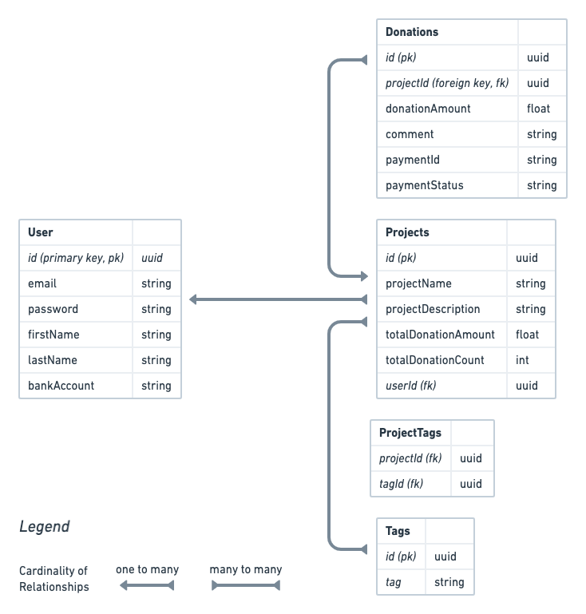

# What is Donatello?

Donatello is a public donations platform with a Dockerized backend built on NodeJS with Express. The database layer is managed by PostgreSQL and Sequelize ORM. I've implemented Mollie which manages the payment transactions. There is an internal reporting dashboard which uses raw SQL to query the data. The app was developed following a TDD approach by using Jest & Supertest.

## Install guide

### Getting started

- clone this repo
- install dependencies: `npm install`

### Setting up .env

- Create an `.env` file in the root of this project in the following format. (Add the correct urls / keys in the steps after this one)

The `.env` file format:

```text
DEV_DATABASE_URL=<postgres url here>
TEST_DATABASE_URL=<postgres url here>
MOLLIE_API_KEY=<mollie api key here>
TOKEN_SECRET=<secret string here>
```

- create 2 postgres database instances: 1 for development, 1 for testing (you can use [elephantsql](https://customer.elephantsql.com/) )
- Paste the database urls into the .env as `DEV_DATABASE_URL` and `TEST_DATABASE_URL`
- Create an account on [Mollie Payments](https://www.mollie.com/), get a `Test API key` from your dashboard,
- Paste in the api key into the .env as `MOLLIE_API_KEY`
- Run `npm run generate:tokensecret` and paste the long string that is logged into .env

### Setting up the database

- run the migrations and seed dummy data using: `npm run db:setup`

### Starting the app

- Development mode using nodemon: `npm run dev`
- Run the tests in watch mode: `npm run test:watch`

- Normal mode: `npm start`
- Tests: `npm test`

## ERD



### User

POST:

- Signup
- Login
- Create a new project
- Add a tag to a project

GET:

- See all of my user details

PATCH/PUT:

- Update my user profile (first & last name, email, password, bank account)
- Update my projects name, description
- Update my projects tags

DELETE:

- Delete projects
- Delete a tag from a project
- Delete my account

### Visitor

GET:

- Get the 10 most recent projects (x number per page) / the 10 most funded projects based on amount / the 10 most popular projects based on number of transactions / filter projects by tags
- Get a list of all of projects for a specific user.
- Get an overview of one specific project & all donations made for it.

### Donation maker

POST:

- Make a new donation for a specific project POST projects/:projectId/donations

request body:

```json
{
  "donationAmount": "100.00",
  "comment": "Here you go"
}
```

- Webhook to update status of payments & total amount & count POST /webhooks/transactions
